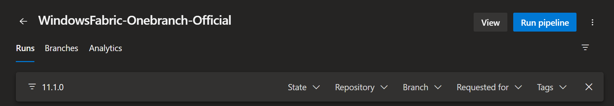
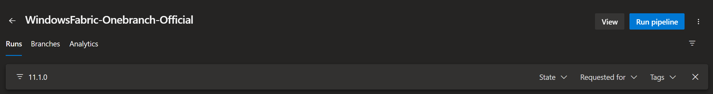
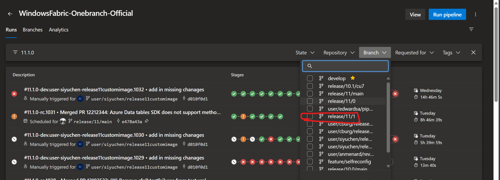
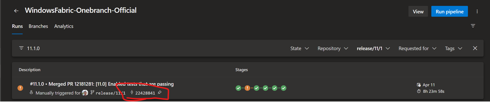
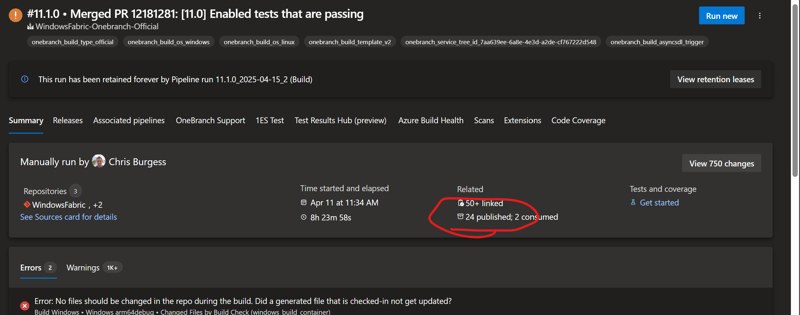
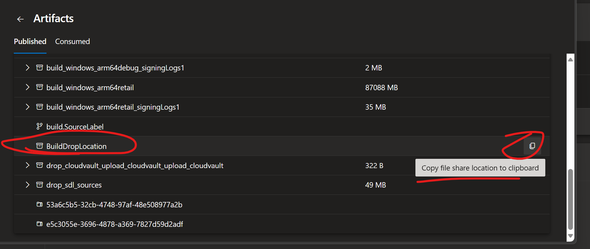

Copyright (C) Microsoft Corporation. All rights reserved.

This file contains the instructions on how to get binaries from SF build knowing a git version tag.

v11.1.0 seems to be (21 Apr 2025) the most advanced. 

`git tag` indicates "v11.1.0" to be 

```
commit 224288418b038238dbc96a7047c0702b444855d3 (HEAD, tag: v11.1.0-rc.1018, tag: v11.1.0)
Author: Stefan Kovac <stefankova@microsoft.com>
Date:   Fri Apr 11 08:29:12 2025 +0000

    Merged PR 12181281: [11.0] Enabled tests that are passing
```

Service Fabric has their official pipeline here: https://dev.azure.com/msazure/One/_build?definitionId=186717&_a=summary

Either DevOps bug, or SF quirk, but next step is a bit "if it doesn't work, retry until it works".

In the filter type "11.1.0" and WAIT. When it works, you get this:



When it doesn't work (or you haven't waited enough... cough... ), it looks like:



Next step is to selected the brach.



This yields 



Note how the SHA is the same as the git tag indicates.

Click on the build and in "Summary" tag there are 24 published arfifacts:



Inside Published artifacts there is a "BuildDropLocation" which contains the reddog drop location:




